# a_graph_project

Fastest graph implementation with test driven approch (multy platform Web, Android, ios ..)
## Structure
one abstract class , 2 implementation of graph , make api for fastest operation with one of design pattern(suitable one) , show graph on screen
## Graph
A Graph is a data structure that captures relationships between objects. It's made up of vertices connected by edges
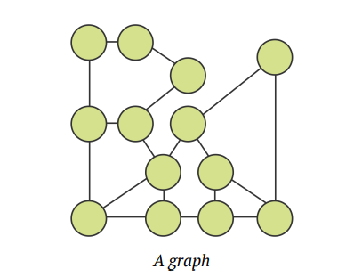

### Weighted Graph
Graph com in a few different flavors. One of most useful characteristic of it is *weighted graph*.
In a **weighted graph**, every edge has a weight associated with it that represents the cost of using this edge.
Look at the edges cost that show on the picture below.
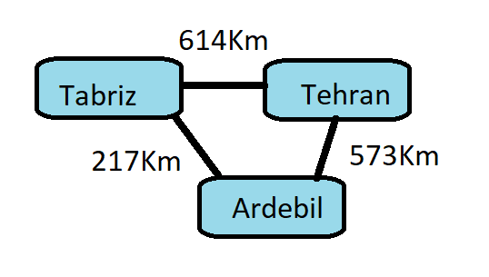
Here is distance table of cities
```text
| Table     | Tabriz | Ardebil | Tehran
| Tabriz    |   0    | 217 KM  | 614 KM
| Ardebil   | 217 KM |    0    | 573 KM
| Tehran    | 614KM  | 573 KM  |    0
```


The weight associated with each edge is distance between these cites. Using this network , you can determine the shortest routes for faster delivery of your values to your precious customers.

### Directed Graph
As well as assigning value to edges in weighted graph, graph can also have direction.Directed graphs are more restrictive to traverse because an edge may only permit traversal in one direction. The diagram below represents a directed graph.
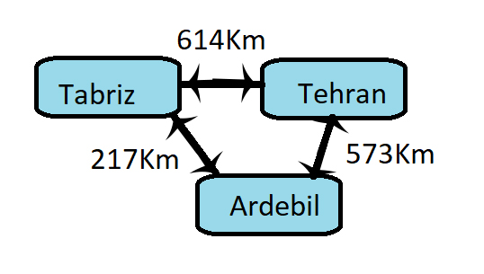
### Un-Directed Graph
If traverse from one *vertex* to another vertex is a 2 way connection in the whole of the graph then it is an un-directed graph or fully directed graph, for implementing an un-directed graph we apply a same weight for edges between each two vertexes.

## Common Operations
For any network of graph we implement create vertex and and add edge methods and vertices property which returns an unmodifiable list of vertices.
Add edge method defines an edge instance with a reference to source and a reference to destination and a associate the weight between source and destination which is by default 1.00.
Before implementing common operations in a graph we need building blocs of graph which is a Vertex class and a Edge class of type E for generic purpose of reusable code.
```dart
 class Vertex<T> {
  final int index;
  final T data;

  const Vertex({
    required this.index,
    required this.data,
  });

  @override
  String toString() => data.toString();
}
```
Every vertex has a unique index within its graph and holds a piece of data such as String, int or any sort of `Obejct?` data.
Now, to connect two vertices, there must be an edge between them.These are the lines in image below.
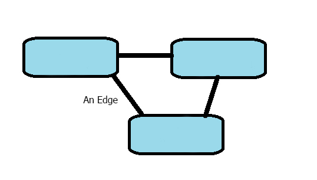
To start defining a graph interface with its common operation we need [EdgeType] enum.
```dart
enum EdgeDirectionType { directed, undirected }
```
Then we add graph interface for generic type of E, usually we use T for specific class Type and E for classes which manages this classes as Element.
```dart
/// Stores a list of vertices in graph network and expose common
/// operations for a graph.
abstract class Graph<E> {
  /// Returns all of the vertices in the graph.
  Iterable<Vertex<E>> get vertices;

  /// Creates a vertex and add it to the graph.
  Vertex<E> createVertex(E data);

  /// Connects the two vertices in the graph with either a
  /// directed or undirected edge.The weight is optional.
  void addEdge(
    Vertex<E> source,
    Vertex<E> destination, {
    EdgeDirectionType edgeType,
    double? weight,
  });

  /// Returns a list of *outgoing* edges from a specific vertex.
  List<Edge<E>> edges(Vertex<E> source);

  /// Returns the weight of the edge between two vertices.
  double? weight(
    Vertex<E> source,
    Vertex<E> destination,
  );
}
```
In the following we implement this interface in two ways, first using the *adjacency list* and second an *adjacency matrix*.
### Adjacency List Implementation
For every vertex in the graph, the graph stores a list of outgoing edges.
Take the distance network we saw earlier:
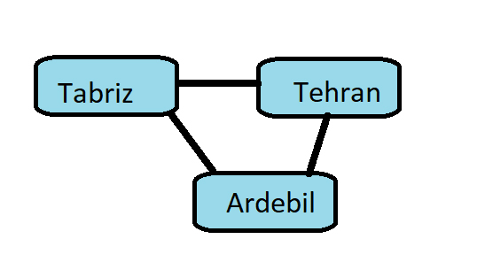
we can describe the relationship between the cities in this 
graph by listing out the adjacent cities for each location:
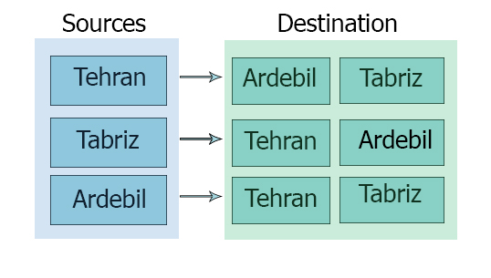
From the adjacency figure we can find a vertex with higher outgoing destination or find out whether there is a route or an edge between 2 vertices or there is not.

An adjacency list is a graph, so we implement the [Graph] interface that we create earlier.
We use a map to store the outgoing edges for each vertex and every vertex has a unique id that could be simply an iterator starting from index 0 and increment each time graph wants to add a new vertex to its network.
```dart
class AdjacencyList<E> implements Graph<E> {
  // A map to store a map of outgoing edges for each vertex.
  final Map<Vertex<E>, List<Edge<E>>> _connections = {};
  var _nextInt = 0;
  
  @override
  Vertex<E> createVertex(E data) {
    final vertex = Vertex<E>(index: _nextInt, data: data);
    _connections[vertex] = [];
    _nextInt++;
    return vertex;
  }

}

```
To get list of vertices we use _connections map's keys.
```dart
Iterable<Vertex<E>> get vertices => _connections.keys;
```
Its time to implement edge between two created vertex with adjacency list implementation of abstract graph class.
Every edge in an undirected graph can be traversed in both directions. So if it's an undirected graph, we need to add two edges, one from the source to the destination and another from the destination to the source.
```dart
  @override
void addEdge(Vertex<E> source, Vertex<E> destination,
    {EdgeDirectionType edgeType = EdgeDirectionType.undirected,
      double? weight}) {
  _connections[source]?.add(
    Edge<E>(
      source: source,
      destination: destination,
      weight: weight
    ),
  );
  // If this is an undirected graph, then also add an edge going
  // the other direction.
  if (edgeType == EdgeDirectionType.undirected) {
    _connections[destination]?.add(
      Edge<E>(
        source: destination,
        destination: source,
        weight: weight
      ),
    );
  }
}
/// Returns the outgoing edges from a vertex.
@override
List<Edge<E>> edges(Vertex<E> source) {
 return _connections[source] ?? [];
}

```
Now, to retrieve the weight of an edge we search for an edge from source to destination. If it exists, we return its weight.
```dart
  @override
  double? weight(Vertex source, Vertex destination) {
    final match = edges(source).where((edge) {
      return edge.destination == destination;
    });
    if (match.isEmpty) return null;
    return match.first.weight;
  }
```
The above method return weight of an edge between a source and a destination and the edge doesn't exists it returns null.
Recall that the weight ts the cost of going from one vertex to another.

Now, its time to make adjacency list printable.
```dart
@override
  String toString() {
    final result = StringBuffer();
    // Loop throw every key-value in connections.
    _connections.forEach((sourceVertex, outgoingEdges) {
      // For every vertex, find all of the destinations and join them into a single, comma-separated string,
      final destinations =
          outgoingEdges.map((edge) => edge.destination).join(', ');
      // Put each vertex and its destinations on a new line.
      result.writeln('$sourceVertex --> $destinations');
    });
    return result.toString();
  }
```
The output of above method would be like 
`Tehran --> Tabriz, Ardebil`
After implement this class we can create a network of vertices and edges between them.
```dart
void main() {
  final graph = AdjacencyList<String>();
  final tehranVertex = graph.createVertex('Tehran');
  final tabrizVertex = graph.createVertex('Tabriz');
  final ardebilVertex = graph.createVertex('Ardebil');
  graph.addEdge(tehranVertex, tabrizVertex, weight: 614);
  graph.addEdge(tehranVertex, ardebilVertex, weight: 573);
  graph.addEdge(tabrizVertex, ardebilVertex, weight: 217);
  print(graph.toString());
}
```
After running above code we get the following output:
```text
Tehran --> Tabriz, Ardebil
Tabriz --> Tehran, Ardebil
Ardebil --> Tehran, Tabriz
```
This output shows a visual description of an adjacency list graph.We can see all the distance or wight from any city.
We can also obtain other helpful information such as the distance from Tehran to Tabriz.This is the weight of the edge between those two vertices.
```dart
  final distance = graph.weight(tehranVertex, tabrizVertex)?.toInt();
  print('The distance between Tehran to Tabriz is $distance Km');
```
Another use case is to know all the available destinations from Tehran, for this we just call edges.
```dart
  print('Tehran destinations are :');
  print('------------------');
  for (final edge in graph.edges(tehranVertex)) {
    print('${edge.source} to ${edge.destination}');
  }
```
Running that will display the destinations in output.
```text
Tehran destinations are :
------------------
Tehran to Tabriz
Tehran to Ardebil
```
### Adjacency Matrix Implementation
An *adjacency matrix* uses a two-dimensional grid or table to implement the graph data structure. Each vertex has its own row and column in the table. The cell where rows and columns intersect hold the edge weights.If any particular cell is empty, that is, if the weight is null, then that means there is no edge between the row vertex and the column vertex.
Bellow is an example of a directed graph that depicts a distance network between cities. As before the weight represents the distance between cities.
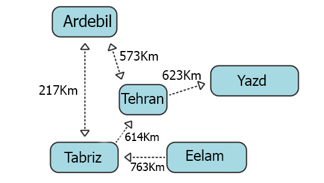
We can represent above network in the matrix form by giving each of five cities a row and a column in a table.Edge that don't exist between two cities are shown with a wight of 0 in the cells where the rows and columns intersect.
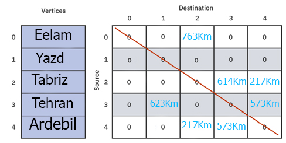
Notes:
* Every vertex in a graph has its own index. These indices are used to label the rows and columns in the table.
* Row number as the source vertex and the column number as the destination vertex.
* [0] [2] is 763Km, so there is a route from Elam to Tabriz with 763Km distance between them.
* [2] [0] is 0, so there is no route from Tabriz to Elam.

To implement adjacency matrix we use a list of vertices and a bi-dimension matrix or table that is a List in a List of double weight values.
In [AdjacencyList] we used a map to store the vertices and edges.Here, though, we store the vertices in a list.We don't use [Edge] to store edges but rather a two-dimensional list of weights.
#### Create a vertex
For every new vertex, we have to add an additional column and row to the matrix.
The first step is to create a new column by adding an additional empty destination at the end of every row.How?
```dart
    for (var i = 0; i < weights.length; i++) {
      weights[i]?.add(null);
    }
```
The next step is to add an additional row representing a new source vertex.How?
```dart
    final row = List<double?>.filled(
      _vertices.length,
      null,
      growable: true,
    );
    weights.add(row);
```
Now we can create a new vertex with adjacency matrix implementation:
```dart
  @override
  Vertex<E> createVertex(E data) {
    final createdVertex = Vertex<E>(
      index: _nextIndex,
      data: data,
    );
    _nextIndex++;
    _vertices.add(createdVertex);
    // Create a new column by adding an additional empty
    // destination at the end of every row.The destination is
    // empty and its value is null because no other vertices have
    // created an edge to the new vertex yet.
    // final columnCount = weights.isEmpty ? 0 : weights.first?.length;
    // final column = List.filled(columnCount ?? 1, null, growable: true);
    // weights.add(column);
    for (var i = 0; i < weights.length; i++) {
      weights[i]?.add(null);
    }
    // Add an additional row representing a new source vertex
    // The weight for this, too, are empty since you haven't yet
    // added any edges.
    // for (final column in weights) {
    //   column?.add(null);
    // }
    final row = List<double?>.filled(
      _vertices.length,
      null,
      growable: true,
    );
    weights.add(row);
    return createdVertex;
  }
```
The next method is [AddEdge] that is simple as adding weights to the matrix.
```dart
  @override
  void addEdge(Vertex<E> source, Vertex<E> destination,
      {EdgeDirectionType edgeType = EdgeDirectionType.undirected,
      double? weight}) {
    // Always add a directed edge.
    weights[source.index]?[destination.index] = weight;
    if (edgeType == EdgeDirectionType.undirected) {
      weights[destination.index]?[source.index] = weight;
    }
  }
```
To get the outgoing edges from a given source 
```dart
  @override
  List<Edge<E>> edges(Vertex<E> source) {
    List<Edge<E>> edges = [];
    // to find all the edges for some source, we loop through all the values in a row.
    for (int column = 0; column < weights.length; column++) {
      final weight = weights[source.index]?[column];
      // Check for weight aren't null. Every non-null weight implies an outgoing edge.
      if (weight == null) continue;
      // use the column number to look up the destination vertex.
      final destination = _vertices[column];
      edges.add(Edge(source: source, destination: destination, weight: weight));
    }

    return edges;
  }
```
And we add weight method that returns the weight between a source and a destination.
```dart
@override
  double? weight(Vertex<E> source, Vertex<E> destination) {
    return weights[source.index]?[destination.index];
  }
```
Lastly we make the adjacency matrix graph printable
```dart
  @override
  String toString() {
    final result = StringBuffer();
    result.writeln('Index | Data');
    // Create a list of vertices.
    for (final vertex in _vertices) {
      result.writeln(
          '${vertex.index.toString().padRight(6)}   ${vertex.data.toString()}');
    }
    // Then we build up a grid of weights, row by row.
    for (int i = 0; i < weights.length; i++) {
      for (int j = 0; j < weights.length; j++) {
        final value = (weights[i]?[j] ?? '.').toString();
        result.write(value.padRight(6));
      }
      result.writeln();
    }
    return result.toString();
  }
```
Now we test the graph methods and build the network of image below

```dart
void main(){
  // Creates a network of adjacency graph
  final matrixGraph = AdjacencyMatrix<String>();
  final elamVertex = matrixGraph.createVertex('Elam');
  final yazdVertex = matrixGraph.createVertex('Yazd');
  final tabrizVertex = matrixGraph.createVertex('Tabriz');
  final tehranVertex = matrixGraph.createVertex('Tehran');
  final ardebilVertex = matrixGraph.createVertex('Ardebil');
  // Two way routes
  matrixGraph.addEdge(tabrizVertex, ardebilVertex, weight: 217);
  matrixGraph.addEdge(tehranVertex, ardebilVertex, weight: 573);
  // One way routes
  matrixGraph.addEdge(elamVertex, tabrizVertex,
      weight: 763, edgeType: EdgeDirectionType.directed);
  matrixGraph.addEdge(tabrizVertex, tehranVertex,
      weight: 614, edgeType: EdgeDirectionType.directed);
  matrixGraph.addEdge(tehranVertex, yazdVertex,
      weight: 623, edgeType: EdgeDirectionType.directed);

  print(matrixGraph.toString());
  // Finding the weight.
  final distance = matrixGraph.weight(tehranVertex, tabrizVertex)?.toInt();
  print('The distance between Tehran to Tabriz is $distance Km');
  // Found destinations of a source.
  print('Tehran destinations are :');
  print('------------------');
  for (final edge in matrixGraph.edges(tehranVertex)) {
    print('${edge.source} to ${edge.destination}');
  }
}
```
and then the output is :
```text
Index | Data
0        Elam
1        Yazd
2        Tabriz
3        Tehran
4        Ardebil
.     .     763.0 .     .     
.     .     .     .     .     
.     .     .     614.0 217.0
.     623.0 .     .     573.0
.     .     217.0 573.0 .


The distance between Tehran to Tabriz is null Km
Tehran destinations are :
------------------
Tehran to Yazd
Tehran to Ardebil
```
## Fastest common operation
This chart compares the cost of different graph operations for adjacency lists and adjacency matrices. **V** represents the number of vertices and **E** represents the number of edges.
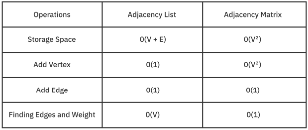
We focus on the fastest operations and use dart isolate to serialize and deserialize these to data structure into each other while maintain them sync together.
### Storage Space
The space efficiency of adjacency graph are better then the adjacency matrix graph but we implement both of them cause nowadays space is not a major problem most of the times and its cheaper than compute resources. 
### Add vertex
Adding a vertex is efficient in an adjacency list: Simply create a vertex and set its key-value pair in the map.It's amortized as O(1).
### Add Edge
Adding edge is efficient in both data structures since they are both constant time.The adjacency list appends to the list of outgoing edges. The adjacency matrix simply sets a value in the two-dimensional list.
### Find Edge and Weight
With an adjacency matrix, finding an edge or weight is a constant-time lookup in the two-dimensional list.
## Design pattern
We need a design pattern to tie these two data structure into one clean API that users of this wrapper shall use.
We could use mediator or even observer design pattern concept but we choose *facade* design pattern for the simplicity of the example.
### Facade Design pattern
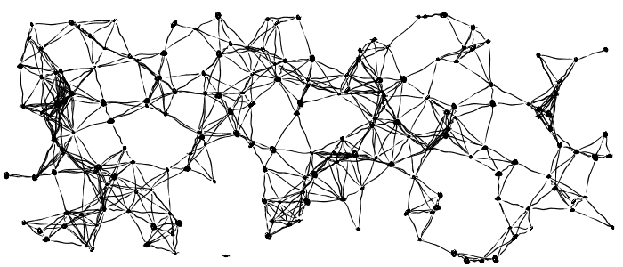
Facade is a structural design pattern which its intention in the *GoF book* is described as:
> Provide a unified interface to a set of interfaces in a subsystem. Facade defines a higher-level interface that makes the subsystem easier to use.

Before designing the structure we need to handle (de-)serialize of the adjacency list and the adjacency matrix graphs.
### Serialize and De-serialize graph
As an experimental example we convert graphs in isolate process and here is how we convert them to each other.
```dart
extension Convert<E> on Graph<E> {
  AdjacencyList toAdjacencyList() {
    if (this is AdjacencyList) {
      return this as AdjacencyList;
    }
    final adjacencyList = AdjacencyList<E>();

    final matrixGraph = this;
    final vertices = matrixGraph.vertices;

    for (final matrixGraphVertex in vertices) {
      // create vertex for each of matrix graph vertex
      final source = adjacencyList.createVertex(matrixGraphVertex.data);
      // find destinations of each vertex in graphMatrix
      final outgoingEdges = matrixGraph.edges(matrixGraphVertex);
      for (final edge in outgoingEdges) {
        final destination = edge.destination;
        // if source and destination is not equal the create edge is not allowed
        if (source == destination) {
          continue;
        }
        // find the weight
        final weight = matrixGraph.weight(source, destination);
        // create an directed edge for each source and destination
        adjacencyList.addEdge(source, destination,
            edgeType: EdgeDirectionType.directed, weight: weight);
      }
    }
    return adjacencyList;
  }
}
```
and here we test this method that converted graphs have the same weight for each correspond element.
```dart
test('should have same weight for each outgoing edge from a source', () {
        // adjacencyList > to matrix;
        final newAdjacencyList =
            Convert<String>(adjacenctyMatrixGraph).toAdjacencyList();
        // get each of adjacency List weights
        // get each of adjacency Matrix weights
        // compare each one with corresponding weight
        print(adjacenctyMatrixGraph);
        for (var sourceIndex = 0;
            sourceIndex < adjacenctyMatrixGraph.weights.length;
            sourceIndex++) {
          final destinations = adjacenctyMatrixGraph.weights[sourceIndex];
          if (destinations == null) {
            throwsA(Exception());
          }
          for (var destinationIndex = 0;
              destinationIndex < destinations!.length;
              destinationIndex++) {
            final matcher =
                adjacenctyMatrixGraph.weights[sourceIndex]?[destinationIndex];

            // final listGraphSourceVertex =
            //     newAdjacencyList.vertices.elementAt(sourceIndex);
            // final listGraphDestinationVertex =
            //     newAdjacencyList.vertices.elementAt(destinationIndex);
            //
            // final outgoingEdges = newAdjacencyList.edges(listGraphSourceVertex);
            final actualSourceVertex =
                adjacenctyMatrixGraph.vertices.elementAt(sourceIndex);
            final actualDestinationVertex =
                adjacenctyMatrixGraph.vertices.elementAt(destinationIndex);
            if (actualSourceVertex == actualDestinationVertex) {
              continue;
            }
            if (matcher == null) {
              final outgoingEdges = newAdjacencyList.edges(actualSourceVertex);
              final outgoingEdgeFromSource = outgoingEdges.where((edge) =>
                  edge.source == actualSourceVertex &&
                  edge.destination == actualDestinationVertex);
              expect(outgoingEdgeFromSource.isEmpty, isTrue);
              continue;
            }
            //compare two values
            // get the actual vertices base on source and destination index of matrix table.
            // for every i and j in matrix there is a vertex in vertices of matrixGarph
            // final sourceVertex and destinationVertex
            // based on these retrieve weight of actual source to actual destination
            final actualWeight = newAdjacencyList.weight(
                actualSourceVertex, actualDestinationVertex);
            expect(actualWeight, matcher);
          }
        }
      });
```
Then we use compute to isolate calculations in flutter.

### Sync graphs with memento design pattern
To solve this we use **memento**, also know as *token* design pattern that belongs to behavioural design patterns.The intention of this is described in the *GoF book*:
> Without violating encapsulation, capture and externalize an object's internal state so that the object can be restored to this state later.

The key idea in this pattern is to make an object (originator) itself responsible for saving and restoring its internal state.
The internal state(a snapshot of it) is saved in another object.
The undo mechanism will request a memento from the originator when it needs to restore the originator's internal state.Clients(caretaker) stores a list of memento objects so that a memento can be passed back to the originator to restore to a previous state.
The general structure of the memento design pattern looks like this:
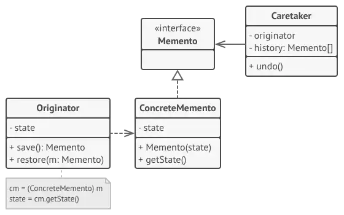
and the use case example is like this:
```dart
/// A base class which can get state and set it to state property.
///
/// It uses save to serialize its state and restore to
/// de-serialize a memento or token to its internal state.
abstract class Originator<T> {
  T? state;

  Memento<T> save();

  void restore(Memento<T> memento);
}

class ConcreteOriginator1<T> extends Originator<T> {
  @override
  Memento<T> save() {
    return ConcreteMemento(state);
  }

  @override
  void restore(Memento<T> memento) {
    state = memento.getState();
  }
}

class ConcreteOriginator2<T> extends Originator<T> {
  @override
  Memento<T> save() {
    return ConcreteMemento(state);
  }

  @override
  void restore(Memento<T> memento) {
    state = memento.getState();
  }
}

/// An abstract class that specific concrete memento class should
/// extends and implement getState to retrieve the data from a
/// memento implementor.
abstract class Memento<T> {
  T? getState();
}

/// A concrete memento class that takes state in its constructor
/// and store it in it's internal state.
class ConcreteMemento<E> extends Memento<E> {
  E? _state;

  ConcreteMemento(E? state) : _state = state;

  @override
  E? getState() => _state;
}

/// A memento and originator manager class that use stack of
/// memento to always get the last snapshot of stored memento.
class CareTaker<E> {
  final List<Originator> originators;
  final Stack<Memento<E>> history;
  CareTaker(this.originators) : history = Stack<Memento<E>>();
  void sync() {
    for (final originator in originators) {
      originator.state = history.peek;
    }
  }

  void saveState(Memento<E> memento) {
    history.push(memento);
  }

  Memento<E>? peek() => history.peek;
}

/// Stack data structure for Last-in Last-out order.
class Stack<E> {
  Stack() : _storage = <E>[];
  E? get peek => _storage.last;
  final List<E> _storage;
  void push(E element) => _storage.add(element);
  E pop() => _storage.removeLast();
}

//This is how we use above classes.
void main() {
  // Create some originators.
  final originator1 = ConcreteOriginator1<String>();
  final originator2 = ConcreteOriginator2<String>();
  // Set its state.
  originator1.state = 'An awesome state 1';
  originator2.state = 'Another awesome state 2';
  // Get their snapshots as a memento object.
  final originator1Snapshot = originator1.save();
  final originator2Snapshot = originator2.save();

  // First save originator 1 and originator 2 in careTaker class.
  final careTaker = CareTaker<String>([originator1, originator2]);
  careTaker.saveState(originator1Snapshot);
  careTaker.saveState(originator2Snapshot);
  careTaker.saveState(originator1Snapshot);
  // test to get latest states.
  print(careTaker.peek()?.getState());
}
```
In distance example of graph the similar classes to memento terms are
Memento : a class that holds a graph state.
Originator: a graph class implementor.
Care taker: a class that manages graph state and returns the latest graph state.

## Conclusion
We used graph and TTD for implementing two type of graph using a weight table matrix and a map of vertices with their destinations.
We used a facade design pattern to get the best possible speed of operations in these two type of graph.

## Getting Started With Flutter


This project is a starting point for a Flutter application.

A few resources to get you started if this is your first Flutter project:

- [Lab: Write your first Flutter app](https://docs.flutter.dev/get-started/codelab)
- [Cookbook: Useful Flutter samples](https://docs.flutter.dev/cookbook)

For help getting started with Flutter development, view the
[online documentation](https://docs.flutter.dev/), which offers tutorials,
samples, guidance on mobile development, and a full API reference.
